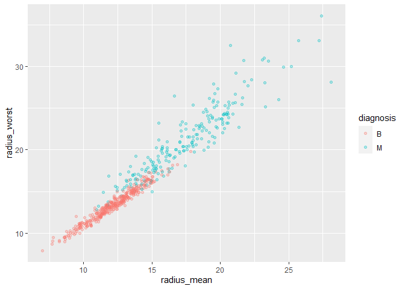
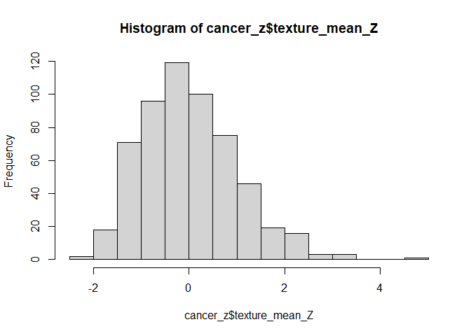
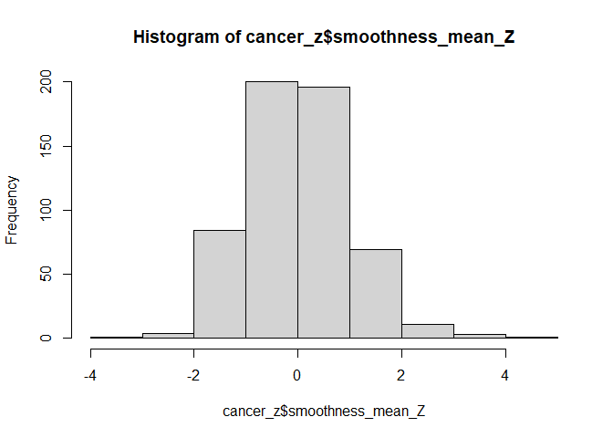
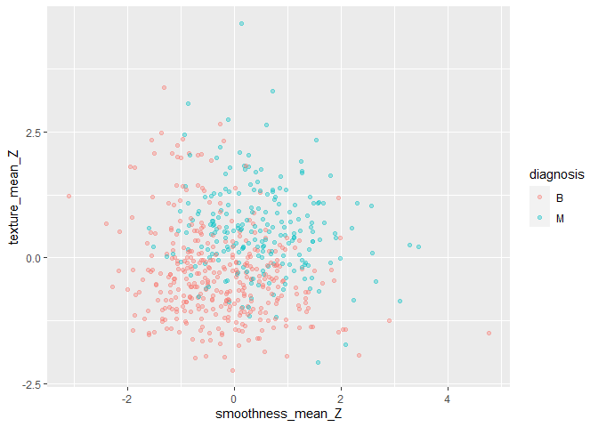
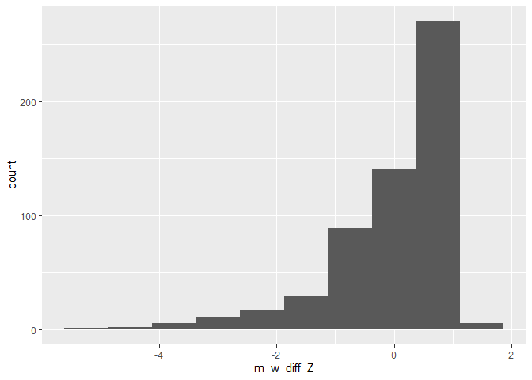
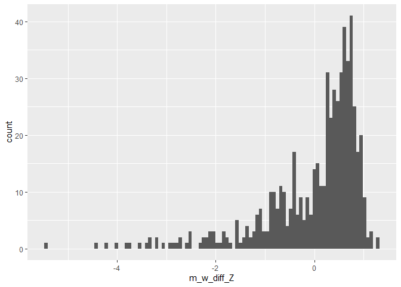
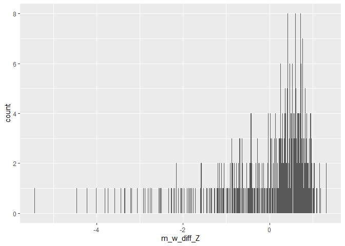

Mini Data Analysis Milestone 2
================

*To complete this milestone, you can either edit [this `.rmd`
file](https://raw.githubusercontent.com/UBC-STAT/stat545.stat.ubc.ca/master/content/mini-project/mini-project-2.Rmd)
directly. Fill in the sections that are commented out with
`<!--- start your work here--->`. When you are done, make sure to knit
to an `.md` file by changing the output in the YAML header to
`github_document`, before submitting a tagged release on canvas.*

# Welcome to the rest of your mini data analysis project!

In Milestone 1, you explored your data. and came up with research
questions. This time, we will finish up our mini data analysis and
obtain results for your data by:

- Making summary tables and graphs
- Manipulating special data types in R: factors and/or dates and times.
- Fitting a model object to your data, and extract a result.
- Reading and writing data as separate files.

We will also explore more in depth the concept of *tidy data.*

**NOTE**: The main purpose of the mini data analysis is to integrate
what you learn in class in an analysis. Although each milestone provides
a framework for you to conduct your analysis, it’s possible that you
might find the instructions too rigid for your data set. If this is the
case, you may deviate from the instructions – just make sure you’re
demonstrating a wide range of tools and techniques taught in this class.

# Instructions

**To complete this milestone**, edit [this very `.Rmd`
file](https://raw.githubusercontent.com/UBC-STAT/stat545.stat.ubc.ca/master/content/mini-project/mini-project-2.Rmd)
directly. Fill in the sections that are tagged with
`<!--- start your work here--->`.

**To submit this milestone**, make sure to knit this `.Rmd` file to an
`.md` file by changing the YAML output settings from
`output: html_document` to `output: github_document`. Commit and push
all of your work to your mini-analysis GitHub repository, and tag a
release on GitHub. Then, submit a link to your tagged release on canvas.

**Points**: This milestone is worth 50 points: 45 for your analysis, and
5 for overall reproducibility, cleanliness, and coherence of the Github
submission.

**Research Questions**: In Milestone 1, you chose two research questions
to focus on. Wherever realistic, your work in this milestone should
relate to these research questions whenever we ask for justification
behind your work. In the case that some tasks in this milestone don’t
align well with one of your research questions, feel free to discuss
your results in the context of a different research question.

# Learning Objectives

By the end of this milestone, you should:

- Understand what *tidy* data is, and how to create it using `tidyr`.
- Generate a reproducible and clear report using R Markdown.
- Manipulating special data types in R: factors and/or dates and times.
- Fitting a model object to your data, and extract a result.
- Reading and writing data as separate files.

# Setup

Begin by loading your data and the tidyverse package below:

``` r
library(datateachr) # <- might contain the data you picked!
library(tidyverse)
```

    ## Warning: package 'tidyverse' was built under R version 4.3.1

    ## Warning: package 'ggplot2' was built under R version 4.3.1

    ## Warning: package 'tibble' was built under R version 4.3.1

    ## Warning: package 'tidyr' was built under R version 4.3.1

    ## Warning: package 'readr' was built under R version 4.3.1

    ## Warning: package 'purrr' was built under R version 4.3.1

    ## Warning: package 'dplyr' was built under R version 4.2.3

    ## Warning: package 'stringr' was built under R version 4.3.1

    ## Warning: package 'forcats' was built under R version 4.3.1

    ## Warning: package 'lubridate' was built under R version 4.3.1

``` r
library(tidymodels) #<- For me loading this package was required to be able to use functions from the "broom" package
```

    ## Warning: package 'tidymodels' was built under R version 4.2.3

    ## Warning: package 'broom' was built under R version 4.3.1

    ## Warning: package 'dials' was built under R version 4.2.3

    ## Warning: package 'scales' was built under R version 4.3.1

    ## Warning: package 'infer' was built under R version 4.2.3

    ## Warning: package 'modeldata' was built under R version 4.2.3

    ## Warning: package 'parsnip' was built under R version 4.2.3

    ## Warning: package 'recipes' was built under R version 4.3.1

    ## Warning: package 'rsample' was built under R version 4.2.3

    ## Warning: package 'tune' was built under R version 4.2.3

    ## Warning: package 'workflows' was built under R version 4.2.3

    ## Warning: package 'workflowsets' was built under R version 4.2.3

    ## Warning: package 'yardstick' was built under R version 4.2.3

``` r
library(here) #<- Required for task 4
```

    ## Warning: package 'here' was built under R version 4.2.3

# Task 1: Process and summarize your data

From milestone 1, you should have an idea of the basic structure of your
dataset (e.g. number of rows and columns, class types, etc.). Here, we
will start investigating your data more in-depth using various data
manipulation functions.

### 1.1 (1 point)

First, write out the 4 research questions you defined in milestone 1
were. This will guide your work through milestone 2:

<!-------------------------- Start your work below ---------------------------->

1.  There seem to be three forms of each “characteristic”. For example,
    there is a radius_mean, radius_se, and radius_worst. I am wondering
    if each form may have a different relationship to the “diagnosis” of
    each observation. For example, do higher values for radius_mean and
    radius_se correspond to higher odds of having a malignant tumor? Or
    do they have unique relationships with diagnoistic results?

2.  I am also interested in understanding the relationship between sets
    of variables that seem to be related conceptually. It could be that
    smoothness and texture refer to similar concepts. So, I would like
    to know: is there any correlation between smoothness_mean and
    texture_mean across observations?

3.  I am curious about the difference between \_mean and \_worst
    variables (e.g., radius_mean vs radius_worst). I am curious if
    having a wider range between the \_mean and the \_worst values is
    also predictive of wether an observation has a malignant tumor.

4.  Ultimately, I am curious to see which factors are most predictive of
    a cancer diagnosis. I have seen that Random Forest can be used to
    estimate variable importance in prediction problems. I would like to
    know, which variables are the most predictive of a cancer diagnosis
    from the ones in the original dataset?
    <!----------------------------------------------------------------------------->

Here, we will investigate your data using various data manipulation and
graphing functions.

### 1.2 (8 points)

Now, for each of your four research questions, choose one task from
options 1-4 (summarizing), and one other task from 4-8 (graphing). You
should have 2 tasks done for each research question (8 total). Make sure
it makes sense to do them! (e.g. don’t use a numerical variables for a
task that needs a categorical variable.). Comment on why each task helps
(or doesn’t!) answer the corresponding research question.

Ensure that the output of each operation is printed!

Also make sure that you’re using dplyr and ggplot2 rather than base R.
Outside of this project, you may find that you prefer using base R
functions for certain tasks, and that’s just fine! But part of this
project is for you to practice the tools we learned in class, which is
dplyr and ggplot2.

**Summarizing:**

1.  Compute the *range*, *mean*, and *two other summary statistics* of
    **one numerical variable** across the groups of **one categorical
    variable** from your data.
2.  Compute the number of observations for at least one of your
    categorical variables. Do not use the function `table()`!
3.  Create a categorical variable with 3 or more groups from an existing
    numerical variable. You can use this new variable in the other
    tasks! *An example: age in years into “child, teen, adult, senior”.*
4.  Compute the proportion and counts in each category of one
    categorical variable across the groups of another categorical
    variable from your data. Do not use the function `table()`!

**Graphing:**

6.  Create a graph of your choosing, make one of the axes logarithmic,
    and format the axes labels so that they are “pretty” or easier to
    read.
7.  Make a graph where it makes sense to customize the alpha
    transparency.

Using variables and/or tables you made in one of the “Summarizing”
tasks:

8.  Create a graph that has at least two geom layers.
9.  Create 3 histograms, with each histogram having different sized
    bins. Pick the “best” one and explain why it is the best.

Make sure it’s clear what research question you are doing each operation
for!

<!------------------------- Start your work below ----------------------------->

> **Comment:** My dataset only contains one categorical variable
> (diagnosis) and the rest are numeric. For the sake of following the
> instructions in the summarizing options I will have to binarize or
> build categories from the numeric variables I have available.

**Question 1:** Does each “form” of the same variable (e.g., \_mean,
\_se, and \_worst) have the same relationship to the “diagnosis”
outcome?

*Summarizing (Option 1):* Compute *four summary statistics* (range,
mean, Standard Deviation, median, and number of observations) of
radius_mean and radius_worst across values for diagnosis.

- How it helps: We can see if patterns across diagnostic groups are
  consistent for both variables. Additionally, the mean, median, and SD
  can be used to estimate the skew of these variables.

``` r
rad_mean_by_diag = cancer_sample %>%
  group_by(diagnosis) %>%
  summarize(range = max(radius_mean) - min(radius_mean),
            mean = mean(radius_mean),
            SD = sd(radius_mean),
            median = median(radius_mean),
            n = n())
rad_mean_by_diag
```

    ## # A tibble: 2 × 6
    ##   diagnosis range  mean    SD median     n
    ##   <chr>     <dbl> <dbl> <dbl>  <dbl> <int>
    ## 1 B          10.9  12.1  1.78   12.2   357
    ## 2 M          17.2  17.5  3.20   17.3   212

``` r
rad_worst_by_diag = cancer_sample %>%
  group_by(diagnosis) %>%
  summarize(range = max(radius_worst) - min(radius_worst),
            mean = mean(radius_worst),
            SD = sd(radius_worst),
            median = median(radius_worst),
            n = n())
rad_worst_by_diag
```

    ## # A tibble: 2 × 6
    ##   diagnosis range  mean    SD median     n
    ##   <chr>     <dbl> <dbl> <dbl>  <dbl> <int>
    ## 1 B          11.9  13.4  1.98   13.4   357
    ## 2 M          23.2  21.1  4.28   20.6   212

*Graphing (Option 7):* Create a *scatterplot with customized alpha
transparency* for radius_mean and radius_worst, while grouping for
“diagnosis” outcome.

- How it helps: Graphing the values for both variables will help us see
  if there is an overall relationship between them. Additionally,
  coloring based on diagnostic group will help us see if there are
  different distributions between groups. Overall, there seems to be a
  positive correlation between radius_mean and radius_worst values, with
  those with malignant tumors tending to have higher values and more
  variance for both variables.

``` r
first_plot = ggplot(cancer_sample, aes(radius_mean, radius_worst, col = diagnosis))+
  geom_point(alpha=0.3)
first_plot
```

<!-- -->

**Question 2:** Are variables that seem “conceptually” similar also
“statistically” similar (.e.g., are values for texture and smoothness
correlated to each other)?

*Summarizing (Option 1):* First, I will convert the values for texture
and smoothness into Z scores so that they are more comparable. Then, I
will *compue four summary statistics* (i.e., range, mean, median,
standard deviation) across diagnostic groups.

- How it helps: Comparing standardized values will make it easier to see
  if distributions for both variables are similar.

``` r
mean_text = mean(cancer_sample$texture_mean)
sd_text = sd(cancer_sample$texture_mean)
mean_smth = mean(cancer_sample$smoothness_mean)
sd_smth = sd(cancer_sample$smoothness_mean)

cancer_z = cancer_sample%>%
  mutate(
    texture_mean_Z = (texture_mean - mean_text) / sd_text,
    smoothness_mean_Z = (smoothness_mean - mean_smth) / sd_smth
  )


texture_table = cancer_z %>%
  group_by(diagnosis) %>%
  summarize(range = max(texture_mean_Z) - min(texture_mean_Z),
            mean = mean(texture_mean_Z),
            SD = sd(texture_mean_Z),
            median = median(texture_mean_Z),
            n = n())
texture_table
```

    ## # A tibble: 2 × 6
    ##   diagnosis range   mean    SD median     n
    ##   <chr>     <dbl>  <dbl> <dbl>  <dbl> <int>
    ## 1 B          5.60 -0.320 0.929 -0.442   357
    ## 2 M          6.72  0.538 0.879  0.505   212

``` r
hist(cancer_z$texture_mean_Z)
```

<!-- -->

``` r
smth_table = cancer_z %>%
  group_by(diagnosis) %>%
  summarize(range = max(smoothness_mean_Z) - min(smoothness_mean_Z),
            mean = mean(smoothness_mean_Z),
            SD = sd(smoothness_mean_Z),
            median = median(smoothness_mean_Z),
            n = n())

smth_table
```

    ## # A tibble: 2 × 6
    ##   diagnosis range   mean    SD median     n
    ##   <chr>     <dbl>  <dbl> <dbl>  <dbl> <int>
    ## 1 B          7.88 -0.276 0.956 -0.398   357
    ## 2 M          5.05  0.465 0.896  0.415   212

``` r
hist(cancer_z$smoothness_mean_Z)
```

<!-- -->

*Graphing (Option 7):* Create a *scatterplot with customized alpha
transparency* for standardized mean texture and mean smoothness scores,
while grouping for “diagnosis” outcome.

- How it helps: A Scatterplot is a useful tool to visualize bivariate
  distributions. Here it is clear that malignant cases have slightly
  higher texture mean values but the correltation is not as strong as
  seen on the first plot.

``` r
second_plot = ggplot(cancer_z, aes(smoothness_mean_Z, texture_mean_Z, col = diagnosis))+
  geom_point(alpha=0.35)

second_plot
```

<!-- -->

**Question 3:** Are wider ranges between \_mean and \_worst associated
with the odds of “diagnosis” outcomes?

*Summarizing (Option 3):* First, I will create a new variable that
stores the difference in raw scores between perimeter_mean and
perimeter_worst. Second, I will convert the values in that column into Z
scores. \_Third, I will *create a categorical variable* with three
categories based on Z score for difference between values (Low = Z \<
-1, Medium = \[-1 \>= Z\] & \[Z \<= 1\], High = Z \> 1)

- How it helps: Categorizing a continuous variable into a factor can be
  helpful when the original distribution is heavily skewed or disperse.
  It can also be helpful if we are interested in looking at specific
  subsets from the overall dataset.

``` r
cancer_diff = cancer_z%>%
  mutate(m_w_diff = (perimeter_mean) - (perimeter_worst))

m_w_diff_Mean = mean(cancer_diff$m_w_diff)

m_w_diff_SD = sd(cancer_diff$m_w_diff)

cancer_diff = cancer_diff %>%
  mutate(m_w_diff_Z = (m_w_diff -m_w_diff_Mean )/ m_w_diff_SD)%>%
  mutate(
    m_w_diff_Factor = factor(case_when(
      m_w_diff_Z < -1 ~ "Low",
      m_w_diff_Z >= -1 &  m_w_diff_Z <= 1 ~ "Medium",
      m_w_diff_Z > 1 ~ "High"),
      levels = c("Low", "Medium", "High"))
  )

table(cancer_diff$m_w_diff_Factor)
```

    ## 
    ##    Low Medium   High 
    ##     73    481     15

*Graphing (Option 9):* I will create *3 histograms with different sized
bins.* for the difference score between perimeter_mean and
perimeter_worst.

- How it helps: Contrasting bin sizes for this histogram will help me
  see which value is optimal for visualization. This will also help me
  see why the group “high” is smaller than the other two.

``` r
# The bins argument controls the number of bars created in a histogram, 
  # too few and patterns will be smoothened, 
  # too many and the graph may look messy

# Bins = 10

bin_1 = ggplot(cancer_diff, aes(x = m_w_diff_Z))+
  geom_histogram(bins = 10)

bin_1
```

<!-- -->

``` r
# Bins = 100

bin_2 = ggplot(cancer_diff, aes(x = m_w_diff_Z))+
  geom_histogram(bins = 100)

bin_2
```

<!-- -->

``` r
# Bins = 1000

bin_3 = ggplot(cancer_diff, aes(x = m_w_diff_Z))+
  geom_histogram(bins = 1000)

bin_3
```

<!-- -->

From the three graphs above (with bins equal to 10, 100, and 1000) it is
clear that the best option is the graph with bins = 100. The first graph
had too few lines and it was not able to properly depict the actual
proportion of observations in the left side of the distribution.
Conversely, the third graph made too many “bars” and improperly
emphasizes the left side of the distribution making the big cluster
closer to “0” on the x-axis look smaller in comparison. Additionally,
the third graph included so many bars that it looks disjointed. The
simplest and most effective histogram is the one with bins = 100.

**Question 4:** Which variables are most predictive of a cancer
diagnosis?

*Summarizing (Option 4):* I will use the variable created in question 3
to *compute the proportion and counts in each category of one
categorical variable across diagnosis groups.*

- How this helps: It will be useful to see if the frequency of the
  factors we just computed are distinct across “diagnosis” categories.

``` r
cancer_diff %>%
  count(diagnosis, m_w_diff_Factor)%>%
  group_by(diagnosis)%>%
  mutate(proportion = prop.table(n))
```

    ## # A tibble: 6 × 4
    ## # Groups:   diagnosis [2]
    ##   diagnosis m_w_diff_Factor     n proportion
    ##   <chr>     <fct>           <int>      <dbl>
    ## 1 B         Low                 1    0.00280
    ## 2 B         Medium            343    0.961  
    ## 3 B         High               13    0.0364 
    ## 4 M         Low                72    0.340  
    ## 5 M         Medium            138    0.651  
    ## 6 M         High                2    0.00943

*Graphing (Option 8):* I will create a graph here with *two geom
layers*.

- How this helps: In this case it id really useful to visualize the
  frequency of values for each group. The table contains a lot of values
  and can be hard to understand fully, a graph can make it easier to see
  trends or differences in frequencies, specially when the bars are not
  stacked.

``` r
ggplot(cancer_diff, aes(x = m_w_diff_Factor, fill = diagnosis)) + 
  geom_bar(position = position_dodge(preserve = "single"))+
  xlab("Difference Between Mean and Worst Perimeter")+
  ylab("Count")+
  labs(fill = "Diagnosis (Benign or Malignant)")
```

<!-- -->

<!----------------------------------------------------------------------------->

### 1.3 (2 points)

Based on the operations that you’ve completed, how much closer are you
to answering your research questions? Think about what aspects of your
research questions remain unclear. Can your research questions be
refined, now that you’ve investigated your data a bit more? Which
research questions are yielding interesting results?

<!------------------------- Write your answer here ---------------------------->

> In relation to each question, in order:

1.  In this case, I am closer to answering my research question. Both
    the \_mean and \_worst variables for radius had a similar trend for
    diagnositc groups (i.e., malignant tumer having larger values for
    both overall). There is still one part that remains unclear, will
    radius_se have the same relationship to diagnosis status as the
    other two variables?

2.  In this case, I am closer to answering my research question. Both
    texture and smoothness appeared to have similar distributions, even
    if they are not seemingly associated with each other. There is still
    some missing information that would be important to have. For
    example, it would be good to know, what is th correlation between
    texture and smoothness across diagnostic groups.

3.  In this case, I am closer to understanding the relationship between
    the difference between variables (e.g., mean vs worst perimeter) is
    associated with the diagnostic characteristic. Still, I have yet to
    compute odds ratios for this factor or compute a similar variable
    for other available variables (e.g., radius).

4.  In this case, I feel that I am marginally closer to understanding my
    research question. For me to fully answer my research question I
    would have to contrast all available variables to be able to truly
    have a sense of which is the “most” predictive. Additionally, the
    frequency table I made showed that there are some cell sizes with
    really low values (e.g., Benign tumors with Low difference between
    mean and worst perimeter, Malignant tumors with High difference
    between mean and worst perimeter). Small cell sizes are a problem if
    we want to do any further statistical modeling using this variable.

> Now that I have some additional information, my research questions
> could be refined further (specially questions 1 and 2). The variable
> computed for question 3 seemed interested by what was shown in the
> graph from questionn 4. However, the bar chart in question 4 also
> helped me see that cell sizes are too small for me to be able to do
> further statistical testing based on the mean vs worst difference
> factor.

<!----------------------------------------------------------------------------->

# Task 2: Tidy your data

In this task, we will do several exercises to reshape our data. The goal
here is to understand how to do this reshaping with the `tidyr` package.

A reminder of the definition of *tidy* data:

- Each row is an **observation**
- Each column is a **variable**
- Each cell is a **value**

### 2.1 (2 points)

Based on the definition above, can you identify if your data is tidy or
untidy? Go through all your columns, or if you have \>8 variables, just
pick 8, and explain whether the data is untidy or tidy.

<!--------------------------- Start your work below --------------------------->

> The original cancer_sample dataset had more than 8 variables, so I
> selected 8 variables for this analysis

``` r
cancer_subset = cancer_sample %>%
  select(ID, diagnosis, radius_mean, radius_worst, 
         radius_se, texture_mean, smoothness_mean, perimeter_mean)
```

``` r
head(cancer_subset, 5)
```

    ## # A tibble: 5 × 8
    ##         ID diagnosis radius_mean radius_worst radius_se texture_mean
    ##      <dbl> <chr>           <dbl>        <dbl>     <dbl>        <dbl>
    ## 1   842302 M                18.0         25.4     1.10          10.4
    ## 2   842517 M                20.6         25.0     0.544         17.8
    ## 3 84300903 M                19.7         23.6     0.746         21.2
    ## 4 84348301 M                11.4         14.9     0.496         20.4
    ## 5 84358402 M                20.3         22.5     0.757         14.3
    ## # ℹ 2 more variables: smoothness_mean <dbl>, perimeter_mean <dbl>

> Here I am testing wether the number of unique ID values, which
> suggests that each row corresponds to one observation only (i.e., that
> this is a cross-sectional sample)

``` r
length_test = length(cancer_subset$ID) == length(unique(cancer_subset$ID))

length_test
```

    ## [1] TRUE

> Here I am caculating the proportion of entries in each column that is
> missing. A value of 0 indicates that there are no missing values.

``` r
# proportion in each column that is missing

percent_missing = colSums(is.na(cancer_subset)) / nrow(cancer_subset)
percent_missing
```

    ##              ID       diagnosis     radius_mean    radius_worst       radius_se 
    ##               0               0               0               0               0 
    ##    texture_mean smoothness_mean  perimeter_mean 
    ##               0               0               0

> Based on the tests run above it is clear that (1) each row is an
> observation, (2) each column is a distinct variable, and (3) each cell
> contains a unique value. Hence, the cancer_sample I have selected is
> *tidy.*

<!----------------------------------------------------------------------------->

### 2.2 (4 points)

Now, if your data is tidy, untidy it! Then, tidy it back to it’s
original state.

If your data is untidy, then tidy it! Then, untidy it back to it’s
original state.

Be sure to explain your reasoning for this task. Show us the “before”
and “after”.

<!--------------------------- Start your work below --------------------------->

**Before**

The cancer sample has no missing values.

``` r
percent_missing = colSums(is.na(cancer_subset)) / nrow(cancer_subset)
percent_missing
```

    ##              ID       diagnosis     radius_mean    radius_worst       radius_se 
    ##               0               0               0               0               0 
    ##    texture_mean smoothness_mean  perimeter_mean 
    ##               0               0               0

**Then**

I make the data untidy by adding missing values at random to a new
column named “missing_values”.

``` r
# Creates values for a new column that randomly assigns missing values
missing = sample(c(NA, 0, 1), nrow(cancer_subset), replace=TRUE)

# Includes new values in a new column called "missing_values"
cancer_subset$missing_values = missing
```

Proof “cancer_subset” is untidy

``` r
percent_missing = colSums(is.na(cancer_subset)) / nrow(cancer_subset)
percent_missing
```

    ##              ID       diagnosis     radius_mean    radius_worst       radius_se 
    ##       0.0000000       0.0000000       0.0000000       0.0000000       0.0000000 
    ##    texture_mean smoothness_mean  perimeter_mean  missing_values 
    ##       0.0000000       0.0000000       0.0000000       0.3532513

**Lastly**

I make the subset tidy by removing these missing values. In future
analysis I will still use the original cancer_subset dataset since it
will not be missing random values. Instead of taking out the column with
missing values, I will exclude rows that have a missing value in the
“missing_values” column.

``` r
cancer_subset_clean = cancer_subset %>%
  drop_na(missing_values)

print(colSums(is.na(cancer_subset_clean)) / nrow(cancer_subset_clean))
```

    ##              ID       diagnosis     radius_mean    radius_worst       radius_se 
    ##               0               0               0               0               0 
    ##    texture_mean smoothness_mean  perimeter_mean  missing_values 
    ##               0               0               0               0

<!----------------------------------------------------------------------------->

### 2.3 (4 points)

Now, you should be more familiar with your data, and also have made
progress in answering your research questions. Based on your interest,
and your analyses, pick 2 of the 4 research questions to continue your
analysis in the remaining tasks:

<!-------------------------- Start your work below ---------------------------->

1.  There seem to be three forms of each “characteristic”. For example,
    there is a radius_mean, radius_se, and radius_worst. I am wondering
    if each form may have a different relationship to the “diagnosis” of
    each observation. For example, do higher values for radius_mean and
    radius_se correspond to higher odds of having a malignant tumor? Or
    do they have unique relationships with diagnoistic results?

2.  I am also interested in understanding the relationship between sets
    of variables that seem to be related conceptually. It could be that
    smoothness and texture refer to similar concepts. So, I would like
    to know: is there any correlation between smoothness_mean and
    texture_mean across observations?

<!----------------------------------------------------------------------------->

Explain your decision for choosing the above two research questions.

<!--------------------------- Start your work below --------------------------->

1.  Responding to question 1.2 I noticed that that the scatterplot I
    made showed a relationship between radius_mean and radius_worst.
    Additionally, it was clear that those with malignant tumors had
    higher values for both overall. I am curious to explore further
    these relationships and whether radius_se has the same pattern
    across diagnostic groups.

2.  While responding to question 1.2 I noticed that the association
    between standardized scores for both variables was not that strong
    but for both it was clear that those with malignant tumours had
    higher values. I am curious to see if the trend is consistent for
    other variables (e.g., perimeter) or other forms of the variable
    (e.g., \_se or \_worst)

<!----------------------------------------------------------------------------->

Now, try to choose a version of your data that you think will be
appropriate to answer these 2 questions. Use between 4 and 8 functions
that we’ve covered so far (i.e. by filtering, cleaning, tidy’ing,
dropping irrelevant columns, etc.).

(If it makes more sense, then you can make/pick two versions of your
data, one for each research question.)

<!--------------------------- Start your work below 
--------------------------->

Here, I am using the original cancer_subset rather than the
cancer_subset_clean because the latter had observations dropped at
random.

I am converting raw scores to Z scores to facilitate comparison between
variables.

``` r
first_subset = cancer_sample %>%
  select(ID, diagnosis, radius_mean, 
         radius_worst, radius_se) %>%
  mutate(
    rad_mean_Z = (radius_mean - mean(radius_mean)) /sd(radius_mean),
    rad_wrst_Z = (radius_worst - mean(radius_worst)) /sd(radius_worst),
    rad_se_Z = (radius_se - mean(radius_se)) /sd(radius_se),
    diagnosis_F = factor(case_when(
      diagnosis == "B" ~ "Benign",
      diagnosis == "M" ~ "Malignant"),
      levels = c("Benign", "Malignant"))
    ) %>%
  select(-radius_mean, -radius_worst, -radius_se, -diagnosis)

head(first_subset, 5)
```

    ## # A tibble: 5 × 5
    ##         ID rad_mean_Z rad_wrst_Z rad_se_Z diagnosis_F
    ##      <dbl>      <dbl>      <dbl>    <dbl> <fct>      
    ## 1   842302      1.10       1.89     2.49  Malignant  
    ## 2   842517      1.83       1.80     0.499 Malignant  
    ## 3 84300903      1.58       1.51     1.23  Malignant  
    ## 4 84348301     -0.768     -0.281    0.326 Malignant  
    ## 5 84358402      1.75       1.30     1.27  Malignant

I am converting raw scores to Z scores to facilitate comparison between
variables.

``` r
second_subset = cancer_sample %>%
  select(ID, diagnosis, 
         radius_mean, perimeter_mean, 
         smoothness_mean, texture_mean) %>%
  mutate(
    rad_mean_Z = (radius_mean - mean(radius_mean))/
      sd(radius_mean),
    per_mean_Z = (perimeter_mean - mean(perimeter_mean))/
      sd(perimeter_mean),
    smth_mean_Z = (perimeter_mean - mean(perimeter_mean))/
      sd(perimeter_mean),
    txt_mean_Z = (texture_mean - mean(texture_mean))/
      sd(texture_mean),
    diagnosis_F = factor(case_when(
      diagnosis == "B" ~ "Benign",
      diagnosis == "M" ~ "Malignant"),
      levels = c("Benign", "Malignant"))
  )%>%
  select(-radius_mean, -perimeter_mean, 
         -smoothness_mean, -texture_mean, -diagnosis)

head(second_subset, 5)
```

    ## # A tibble: 5 × 6
    ##         ID rad_mean_Z per_mean_Z smth_mean_Z txt_mean_Z diagnosis_F
    ##      <dbl>      <dbl>      <dbl>       <dbl>      <dbl> <fct>      
    ## 1   842302      1.10       1.27        1.27      -2.07  Malignant  
    ## 2   842517      1.83       1.68        1.68      -0.353 Malignant  
    ## 3 84300903      1.58       1.57        1.57       0.456 Malignant  
    ## 4 84348301     -0.768     -0.592      -0.592      0.254 Malignant  
    ## 5 84358402      1.75       1.78        1.78      -1.15  Malignant

# Task 3: Modelling

## 3.0 (no points)

Pick a research question from 1.2, and pick a variable of interest
(we’ll call it “Y”) that’s relevant to the research question. Indicate
these.

<!-------------------------- Start your work below ---------------------------->

**Research Question**: I will choose the first question from 2.3 which
is: “For example, do higher values for radius_mean and radius_se
correspond to higher odds of having a malignant tumor? Or do they have
unique relationships with diagnoistic results?”

**Variable of interest**: My Outcome in this cases will be diagnosis
(i.e., Benign or Malignant). I will run two models, both with diagnosis
as the outcomes, but either standardized radius_mean or radius_se as
predictors.

<!----------------------------------------------------------------------------->

## 3.1 (3 points)

Fit a model or run a hypothesis test that provides insight on this
variable with respect to the research question. Store the model object
as a variable, and print its output to screen. We’ll omit having to
justify your choice, because we don’t expect you to know about model
specifics in STAT 545.

- **Note**: It’s OK if you don’t know how these models/tests work. Here
  are some examples of things you can do here, but the sky’s the limit.

  - You could fit a model that makes predictions on Y using another
    variable, by using the `lm()` function.
  - You could test whether the mean of Y equals 0 using `t.test()`, or
    maybe the mean across two groups are different using `t.test()`, or
    maybe the mean across multiple groups are different using `anova()`
    (you may have to pivot your data for the latter two).
  - You could use `lm()` to test for significance of regression
    coefficients.

<!-------------------------- Start your work below ---------------------------->

Making the first model, diagnosis predicted by standardized radius_se.

``` r
se_logistic = glm(diagnosis_F ~ rad_se_Z, data = first_subset, family = "binomial")
```

Printing the model on the screen:

``` r
(se_logistic)
```

    ## 
    ## Call:  glm(formula = diagnosis_F ~ rad_se_Z, family = "binomial", data = first_subset)
    ## 
    ## Coefficients:
    ## (Intercept)     rad_se_Z  
    ##     -0.3693       2.6395  
    ## 
    ## Degrees of Freedom: 568 Total (i.e. Null);  567 Residual
    ## Null Deviance:       751.4 
    ## Residual Deviance: 480.6     AIC: 484.6

Making the second model, diagnosis predicted by standardized radius_se.

``` r
mean_logistic = glm(diagnosis_F ~ rad_mean_Z, data = first_subset, family = "binomial")
```

Printing the model on the screen:

``` r
(mean_logistic)
```

    ## 
    ## Call:  glm(formula = diagnosis_F ~ rad_mean_Z, family = "binomial", 
    ##     data = first_subset)
    ## 
    ## Coefficients:
    ## (Intercept)   rad_mean_Z  
    ##     -0.6441       3.6424  
    ## 
    ## Degrees of Freedom: 568 Total (i.e. Null);  567 Residual
    ## Null Deviance:       751.4 
    ## Residual Deviance: 330   AIC: 334

<!----------------------------------------------------------------------------->

## 3.2 (3 points)

Produce something relevant from your fitted model: either predictions on
Y, or a single value like a regression coefficient or a p-value.

- Be sure to indicate in writing what you chose to produce.
- Your code should either output a tibble (in which case you should
  indicate the column that contains the thing you’re looking for), or
  the thing you’re looking for itself.
- Obtain your results using the `broom` package if possible. If your
  model is not compatible with the broom function you’re needing, then
  you can obtain your results by some other means, but first indicate
  which broom function is not compatible.

<!-------------------------- Start your work below ---------------------------->

> I chose to produce the P-value from the first model I ran.
> Specifically, I extracted the p-value on the coefficient for the
> effect of rad_se_Z. This p-value will indicate whether the stadardized
> radius_se variable has a statistically significant association to the
> diagnosis variable.

> The value itself that I am interested in is stored in the
> ‘p_value_radius_se’ object. The result was obtained using the ‘tidy’
> function from the ‘broom’ package.

Using the ‘tidy’ function from the ‘brrom’ package on the model to see
the clean output.

``` r
model_tibble = tidy(se_logistic)
model_tibble
```

    ## # A tibble: 2 × 5
    ##   term        estimate std.error statistic  p.value
    ##   <chr>          <dbl>     <dbl>     <dbl>    <dbl>
    ## 1 (Intercept)   -0.369     0.118     -3.13 1.77e- 3
    ## 2 rad_se_Z       2.64      0.239     11.0  2.34e-28

P-value of the radius se coefficient. In this case, the p-value is less
than 0.05 which indicates that there is a statistically significant
association between radius standard error and the odds of having a
malignant tumor in our cancer sample dataset.

``` r
p_value_radius_se = model_tibble[2, 5]
p_value_radius_se
```

    ## # A tibble: 1 × 1
    ##    p.value
    ##      <dbl>
    ## 1 2.34e-28

Because I am running a logistic regression, it is needed to exponentiate
the “estimate” from the model to be able to interpret the Odds Ratios.

``` r
OR_se_logistic = exp(coef(se_logistic))[2]

OR_se_logistic
```

    ## rad_se_Z 
    ##   14.006

<!----------------------------------------------------------------------------->

# Task 4: Reading and writing data

Get set up for this exercise by making a folder called `output` in the
top level of your project folder / repository. You’ll be saving things
there.

## 4.1 (3 points)

Take a summary table that you made from Task 1, and write it as a csv
file in your `output` folder. Use the `here::here()` function.

- **Robustness criteria**: You should be able to move your Mini Project
  repository / project folder to some other location on your computer,
  or move this very Rmd file to another location within your project
  repository / folder, and your code should still work.
- **Reproducibility criteria**: You should be able to delete the csv
  file, and remake it simply by knitting this Rmd file.

<!-------------------------- Start your work below ---------------------------->

I chose the first table from the answer to my first question, which
contains the range, mean, standard deviation, median, and number of
observations for radius_mean from the original cancer_sample.

``` r
rad_mean_by_diag
```

    ## # A tibble: 2 × 6
    ##   diagnosis range  mean    SD median     n
    ##   <chr>     <dbl> <dbl> <dbl>  <dbl> <int>
    ## 1 B          10.9  12.1  1.78   12.2   357
    ## 2 M          17.2  17.5  3.20   17.3   212

Here I am writing to a csv named “rad_mean_by_diag” to be saved in the
“output” folder.

``` r
write.csv(rad_mean_by_diag,file=here::here("output","rad_mean_by_diag.csv"), row.names=FALSE)
```

<!----------------------------------------------------------------------------->

## 4.2 (3 points)

Write your model object from Task 3 to an R binary file (an RDS), and
load it again. Be sure to save the binary file in your `output` folder.
Use the functions `saveRDS()` and `readRDS()`.

- The same robustness and reproducibility criteria as in 4.1 apply here.

<!-------------------------- Start your work below ---------------------------->

I chose to save the “se_logistic” logistic model in this case.

``` r
(se_logistic)
```

    ## 
    ## Call:  glm(formula = diagnosis_F ~ rad_se_Z, family = "binomial", data = first_subset)
    ## 
    ## Coefficients:
    ## (Intercept)     rad_se_Z  
    ##     -0.3693       2.6395  
    ## 
    ## Degrees of Freedom: 568 Total (i.e. Null);  567 Residual
    ## Null Deviance:       751.4 
    ## Residual Deviance: 480.6     AIC: 484.6

Save the model into an .RDS file named “output”,“se_logistic_model.RDS”

``` r
saveRDS(se_logistic, file=here::here("output","se_logistic_model.RDS"))
```

Read the model into a second object named “reloaded_model”

``` r
reloaded_model = readRDS(here::here("output","se_logistic_model.RDS"))
(reloaded_model)
```

    ## 
    ## Call:  glm(formula = diagnosis_F ~ rad_se_Z, family = "binomial", data = first_subset)
    ## 
    ## Coefficients:
    ## (Intercept)     rad_se_Z  
    ##     -0.3693       2.6395  
    ## 
    ## Degrees of Freedom: 568 Total (i.e. Null);  567 Residual
    ## Null Deviance:       751.4 
    ## Residual Deviance: 480.6     AIC: 484.6

<!----------------------------------------------------------------------------->

# Overall Reproducibility/Cleanliness/Coherence Checklist

Here are the criteria we’re looking for.

## Coherence (0.5 points)

The document should read sensibly from top to bottom, with no major
continuity errors.

The README file should still satisfy the criteria from the last
milestone, i.e. it has been updated to match the changes to the
repository made in this milestone.

## File and folder structure (1 points)

You should have at least three folders in the top level of your
repository: one for each milestone, and one output folder. If there are
any other folders, these are explained in the main README.

Each milestone document is contained in its respective folder, and
nowhere else.

Every level-1 folder (that is, the ones stored in the top level, like
“Milestone1” and “output”) has a `README` file, explaining in a sentence
or two what is in the folder, in plain language (it’s enough to say
something like “This folder contains the source for Milestone 1”).

## Output (1 point)

All output is recent and relevant:

- All Rmd files have been `knit`ted to their output md files.
- All knitted md files are viewable without errors on Github. Examples
  of errors: Missing plots, “Sorry about that, but we can’t show files
  that are this big right now” messages, error messages from broken R
  code
- All of these output files are up-to-date – that is, they haven’t
  fallen behind after the source (Rmd) files have been updated.
- There should be no relic output files. For example, if you were
  knitting an Rmd to html, but then changed the output to be only a
  markdown file, then the html file is a relic and should be deleted.

Our recommendation: delete all output files, and re-knit each
milestone’s Rmd file, so that everything is up to date and relevant.

## Tagged release (0.5 point)

You’ve tagged a release for Milestone 2.

### Attribution

Thanks to Victor Yuan for mostly putting this together.
